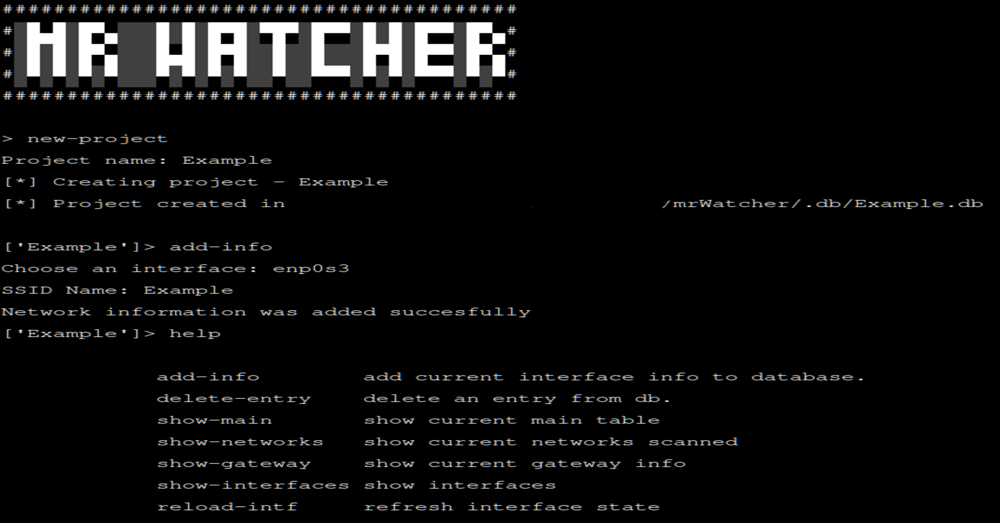

<a name="readme-top"></a>
<div align="center">
    
  </a>
  <h1 align="center">Mr.Watcher: A fast automated network scanner!</h1>
</div>

<details>
  <summary>Table of Contents</summary>
  <ol>
    <li>
      <a href="#about-the-project">About The Project</a>
      <ul>
        <li><a href="#built-with">Built With</a></li>
      </ul>
    </li>
    <li>
      <a href="#getting-started">Getting Started</a>
      <ul>
        <li><a href="#installation">Installation</a></li>
      </ul>
    </li>
    <li><a href="#usage">Usage</a></li>
    <li><a href="#license">License</a></li>
    <li><a href="#contact">Contact</a></li>
  </ol>
</details>

## About The Project
</br>

</br>
Mr Watcher is a tool to perform automated mappings within a network, obtaining data such as IP addresses, network addresses, 
information about the default-gateway, among others. The main objective of Mr. Watcher is to automate the process with a simple
command and incorporate the results into an SQLite database to then be viewed quickly and easily. It is also possible to export 
and load projects for ease of use. Mr Watcher is capable of handling different types of network packets to obtain precise
information and have a general view of the network in which the machine is located.

<p align="right">(<a href="#readme-top">back to top</a>)</p>

### Built With

Mr Watcher was built with Python3.11 and ShellScript. It also use SQLite Database to store information

[![Python][Python.org]][Python-url]
</br>
[![Bash][BashScript]][BashScript-url]
</br>
[![SQLite][SQLite.org]][SQLite-url]
</br>

<strong>Note</strong>: Currently this tool is only compatible with GNU/Linux,
and it was written using Debian Distro
</br>
</br>
[![Debian][Debian.org]][Debian-url]

## Getting Started
Mr Watcher is run from the terminal. Preferably, to avoid any inconvenience with incompatibility in modules and libraries,
it's recommended to create a virtual environment to install the modules.


### Installation

1. Clone this repository
   ```sh
   git clone https://github.com/The-Cr0ws/mrWatcher.git
   
   ```
2. Create a Desktop Environment and activate (optional)
   ```sh
   python3 -m venv mrWatcherVenv
   source mrWatcherVen/bin/activate
   ```
3. Install modules
   ```sh
   pip install -r requirements.txt
   ```
4. Execute 'install.sh' using root permisions
   ```sh
   sudo ./install.sh
   ```

<p align="right">(<a href="#readme-top">back to top</a>)</p>

## Usage
To start Mr.Watcher you must have root permissions, since it handles network packages and protocols in depth, so before running the python 
file (and activating the virtual environment) you must change the user to the root user.

Once started, you can use the 'help' command to obtain information about the different menus, and perform different actions

<p align="right">(<a href="#readme-top">back to top</a>)</p>

## License

Distributed under the MIT License. See `LICENSE.txt` for more information.

<p align="right">(<a href="#readme-top">back to top</a>)</p>

## Contact

The-Cr0ws - the.kr0ws1@proton.me
</br>
Github Profe Link: [https://github.com/The-Cr0ws](https://github.com/The-Cr0ws)

<p align="right">(<a href="#readme-top">back to top</a>)</p>


[Python.org]: https://img.shields.io/badge/Python-3776AB?style=for-the-badge&logo=python&logoColor=white
[Python-url]: https://www.python.org

[SQLite.org]: https://img.shields.io/badge/SQLite-07405E?style=for-the-badge&logo=sqlite&logoColor=white
[SQLite-url]: https://www.sqlite.org/

[BashScript]: https://img.shields.io/badge/Shell_Script-121011?style=for-the-badge&logo=gnu-bash&logoColor=white
[BashScript-url]: https://www.gnu.org/software/bash/

[Debian.org]: https://img.shields.io/badge/Debian-A81D33?style=for-the-badge&logo=debian&logoColor=white
[Debian-url]: https://www.debian.org/
